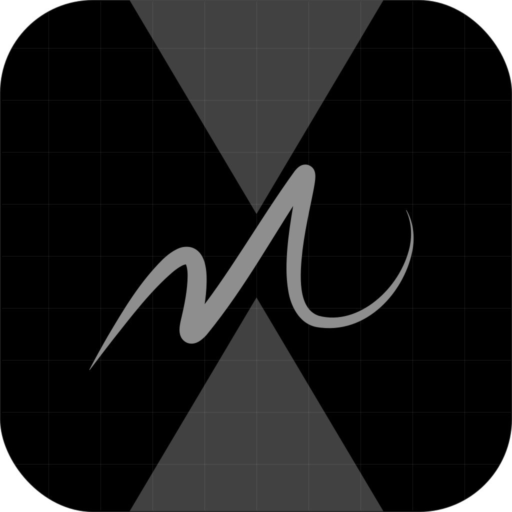

<div align="center" style="display:flex;flex-direction:column;align-items:center;border:0;">
  
  <h1 style="border:0"><a href="https://multitouch.stelan.io" style="border:0;">Multitouch</a></h1>
  <h3 style="border:0;margin-top:0;">Bringing trackpad gestures to the web</h3>
  <p align="center">
    Unlock the full potential of your MacBook's trackpad. Access raw multi-finger data, create gesture-controlled interfaces, and build experiences that weren't possible before.
  </p>
</div>

## Summary

This repository provides a Chrome extension and a native macOS helper that together expose low-level trackpad frame data to web pages via the Chrome Native Messaging API.

## Contents

-   `c/` — Native helper source (C) and build output. Captures multitouch/trackpad frames and communicates with Chrome via Native Messaging.
-   `extension/` — Chrome extension source (background & content scripts, manifest, icons). Forwards native messages into pages as `trackpad` CustomEvents.
-   `landing-page/` — React + Vite demo app used to exercise the extension and show examples. Hosted at [https://multitouch.stelan.io](https://multitouch.stelan.io).
-   Root scripts:
    -   `compile.sh`, `compile-and-package.sh`, `package.sh`, `build-extension.sh` — build and packaging helpers.
    -   `uninstall.sh` — uninstall helper/manifest.

## Quick overview

The native helper (`c/main.c`) writes framed JSON to stdout for Chrome to receive via Native Messaging. The extension background page connects to that native host and forwards frames into the active tab. A content script dispatches a page-level CustomEvent named `trackpad` so website JavaScript can consume raw frame objects.

## Installation

**Note: This is a guide for building and running multitouch locally. If you're just interested in downloading and using the live version, follow the instructions at [https://multitouch.stelan.io/install](https://multitouch.stelan.io/install).**

To install all the components of multitouch locally, follow these steps:

1.  Compile the C program (`c/main.c`). I've provided a handy `compile.sh` script that runs the compilation with the necessary frameworks. If it compiles successfully, the binary output should now be available at `c/build/multitouch`
2.  Place the compiled C program in your desired location. I recommend `/usr/local/bin/`. Note: if you choose to place it somewhere else, you will have to update `field` in `com.stelan.multitouch.json` to point to this new location.
3.  Load the extension into Chrome. In Chrome, go to the extensions page by either entering `chrome://extensions` in to the URL address bar, or by going to `Settings` > `Extensions` > `Manage Extensions`, then click on `Load unpacked` and select the `extension/` directory in this repo. Copy the generated extension ID and replace the `allowed_origins` entry in `com.stelan.multitouch.json` with `"chrome-extension://{EXTENSION_ID}/"`.
4.  Place `com.stelan.multitouch.json` into `/Library/Google/Chrome/NativeMessagingHosts/`.

## Testing the integration

-   In Chrome, click on the extension icon and press the play button to start it.
-   Open any page with site access. In DevTools Console run:

```javascript
window.addEventListener("trackpad", (e) => console.log("trackpad", e.detail));
```

-   Place fingers on the macOS trackpad — you should see `trackpad` event objects logged as the native helper sends frames through the extension.

## Troubleshooting

If no events appear:

-   Confirm the manifest `com.stelan.multitouch.json` is installed in the correct `/Library/Google/Chrome/NativeMessagingHosts/`, the `path` points to the native C binary and the `allowed_origins` contains the string `"chrome-extension://{EXTENSION_ID}/"`.
-   Verify the native helper runs/starts and that `compile.sh` completed without errors.

## Contributing to this project

-   For contributions, open issues or pull requests against this repo.
